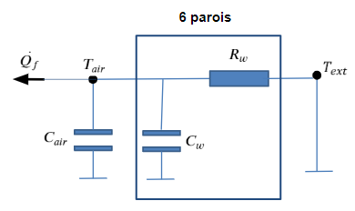
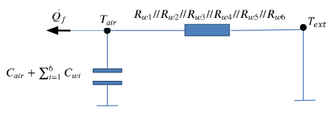
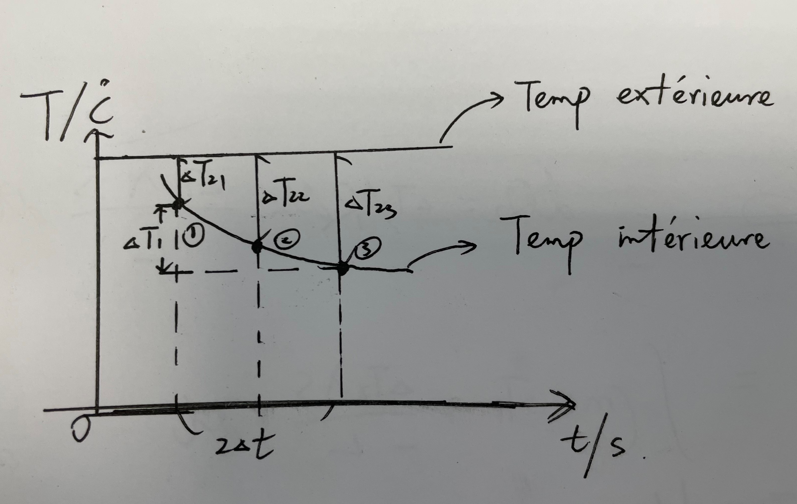

# Temperature-Prediction

### Objectif
Prévoir la puissance de la machine frigorifique à partir de la courbe température-temps à l'aide des paramètres de la caisse mesurée.

### Modèle

Une analogie thermique-électrique est donnée par la graphe ci-dessus. $R_w = \frac{L_w}{\lambda_w*S_w}$ est la résistance thermique de chaque paroi, $C_w$ est la capacité thermique de chaque paroi, $C_{air}$ est la capacité d'air intérieur. 

Ce circuit thermique est équivalent au circuit ci-dessous:

On note $R_{w1}//R_{w2}//R_{w3}//R_{w4}//R_{w5}//R_{w6}$ comme $R_{equi}$, alors le bilan de puissance est: 

$$
\dot{Q_f} = \frac{T_{air}-T_{ext}}{R_{equi}} + (C_{air}+\sum_{i=1}^{6}C_{wi})\frac{dT}{dt}
$$

où $\dot{Q_f} = P$ est la puissance de la machine frigorifique.

### Principe
Seule la partie de la courbe où la température diminue avec le temps est prise en compte. La puissance moyenne entre chaque deux points d'échantillonnage est calculée. 

Sur l'image ci-dessus, la puissance au point 2 est approximé par la puissance moyenne entre le point 1 et le point 3 où deux processus sont pris en compte. D'une part, l'énergie nécessaire pour abaisser la température de l'air à l'intérieur de la caisse, et d'autre part, la chaleur transférée à travers du parois. La somme de l'énergie de ces deux processus est l'énergie fournie par la machine frigorifique.

L'énergie pour baisser la température intérieure peut être obtenue à partir de la capacité thermique massique et le décalage de température entre ces deux points :

$$
Q_1 = (m_{air}+m_{wall})*c*\Delta T_1 \\
\\
\text{$m_{air}$: masse d'air à l'intérieur}\\
\text{$m_{wall}$: masse d'isolant}\\
\text{c: capacité thermique de l'air}
$$

L'énergie de la conduction thermique est obtenue à partir du théorème de Fourier. Sur chacune des 6 surfaces intérieures, l'énergie conductive est:

$$
q = \frac{\lambda*S*\Delta T}{L}*time \\
\\
\text{$\lambda$: coefficient de la conductivité thermique}\\
\text{S: aire de surface}\\
\text{L: épaisseur du parois}\\
\text{$\Delta T$: décalage de température, supposé à rester stable}
$$

Sur l'image au-dessus, $\Delta T$ est traité comme le décalage moyenne de ces 3 points, à savoir :

$$
\Delta T = \frac{\Delta T_{21} + 2*\Delta T_{22} + \Delta T_{23}}{4}\\
time = 2*\Delta t
$$

Supposons que les énergies de conduction ainsi obtenues sont numérotées $q_1, q_2, q_3, q_4, q_5, q_6$ sur les 6 surfaces intérieures, alors l'énergie de conduction totale est la somme de ces six énergies :

$$
Q_2 = \sum_{i=1}^6 q_i
$$

La puissance approximée de la machine frigorique au point 2 est donc :

$$
\bar{P} = \frac{Q_1+Q_2}{2\Delta t}
$$
